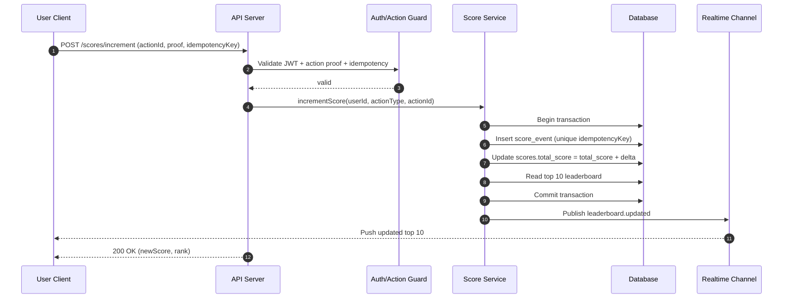

# Scoreboard API Module Specification

This document specifies the backend API module for a live scoreboard feature.
The target audience is a backend engineering team that will implement and operate this module.

## Objective

Build a secure backend module that:
- stores and updates user scores based on valid user actions,
- exposes a top-10 leaderboard,
- pushes live leaderboard updates to connected clients,
- prevents unauthorized or malicious score manipulation.

## Scope

- In scope:
  - score increment endpoint (triggered by action completion),
  - top-10 leaderboard retrieval endpoint,
  - live update channel (WebSocket or Server-Sent Events),
  - action validation and anti-abuse controls,
  - audit logging for score mutations.
- Out of scope:
  - front-end rendering/UX,
  - definition of the business action itself,
  - identity provider implementation (assume auth token already exists).

## Functional Requirements

1. Show top 10 users by score.
2. Users can complete an action that increases their score.
3. Client dispatches API request to update score after action completion.
4. Scoreboard updates should be visible in near real-time.
5. Unauthorized/malicious score increases must be blocked.

## Non-Functional Requirements

- **Security**: all write endpoints require authenticated user context and signed action proof.
- **Consistency**: score increments must be atomic.
- **Latency**: leaderboard reads should be fast (p95 < 150ms target).
- **Scalability**: support high read fanout for live updates.
- **Observability**: logs, metrics, and trace IDs for score update flow.

## Proposed Module Design

- `ScoreController`
  - handles HTTP/WebSocket/SSE interaction,
  - maps DTOs to service calls.
- `ScoreService`
  - validates action claims,
  - applies scoring rules,
  - coordinates repository + pub/sub publish.
- `ScoreRepository`
  - persists scores and action events,
  - returns top-10 leaderboard query.
- `LiveUpdatePublisher`
  - emits scoreboard update events to subscribers.
- `ActionAuthGuard` / middleware
  - verifies JWT/session and action signature/idempotency key.

## Data Model (Conceptual)

### `users`
- `id` (string, PK)
- `display_name` (string)
- `is_banned` (boolean)

### `scores`
- `user_id` (string, PK/FK -> users.id)
- `total_score` (integer, non-negative)
- `updated_at` (timestamp)

### `score_events`
- `id` (string, PK)
- `user_id` (string, FK)
- `action_type` (string)
- `score_delta` (integer > 0)
- `idempotency_key` (string, unique)
- `created_at` (timestamp)
- `metadata` (json)

## API Contract (v1)

### 1) Increment score after action completion

- `POST /api/v1/scores/increment`

Request body:

```json
{
  "actionType": "daily_quiz_completed",
  "actionId": "evt_12345",
  "idempotencyKey": "6f328e53-418f-48f4-9ca1-3258bd5f6540",
  "proof": "signed-proof-or-server-issued-token"
}
```

Response:

```json
{
  "userId": "u_1001",
  "newScore": 1230,
  "delta": 10,
  "leaderboardRank": 7
}
```

Validation and security rules:
- require authenticated user token,
- require valid action proof (signed, unexpired, intended for same user),
- require unique `idempotencyKey` per logical action,
- reject duplicates without double-counting.

### 2) Get top-10 leaderboard

- `GET /api/v1/leaderboard?limit=10`

Response:

```json
{
  "generatedAt": "2026-05-04T15:00:00.000Z",
  "items": [
    { "rank": 1, "userId": "u_1", "displayName": "Alice", "score": 5000 }
  ]
}
```

### 3) Subscribe to live leaderboard updates

- `GET /api/v1/leaderboard/stream` (SSE)  
  or  
- `WS /api/v1/leaderboard/ws` (WebSocket)

Event payload:

```json
{
  "type": "leaderboard.updated",
  "generatedAt": "2026-05-04T15:00:00.000Z",
  "items": []
}
```

## Execution Flow Diagram



## Abuse Prevention Strategy

- JWT/session auth on all write operations.
- Signed action proof generated by trusted backend component.
- Idempotency key + unique DB constraint to stop replay attacks.
- Optional rate limiting per user/IP/device.
- Server-side scoring rules only (never trust client-provided `delta`).
- Audit trail in `score_events` for forensic checks.

## Error Handling (Examples)

- `401 Unauthorized`: missing/invalid auth token.
- `403 Forbidden`: action proof invalid/expired/user mismatch.
- `409 Conflict`: duplicate action or idempotency key replay.
- `422 Unprocessable Entity`: malformed payload.
- `429 Too Many Requests`: throttled due to abuse protection.

## Additional Comments for Improvement

- Add Redis sorted-set cache for leaderboard reads; keep DB as source of truth.
- Introduce background reconciliation job to detect score drift/anomalies.
- Add anti-cheat heuristics (impossible action frequency, bot-like patterns).
- Add integration tests for idempotency and concurrent score updates.
- Version the API (`/v1`) from day one for safer future changes.
- Define explicit SLOs and alerts (error rate, stream disconnect rate, update lag).
