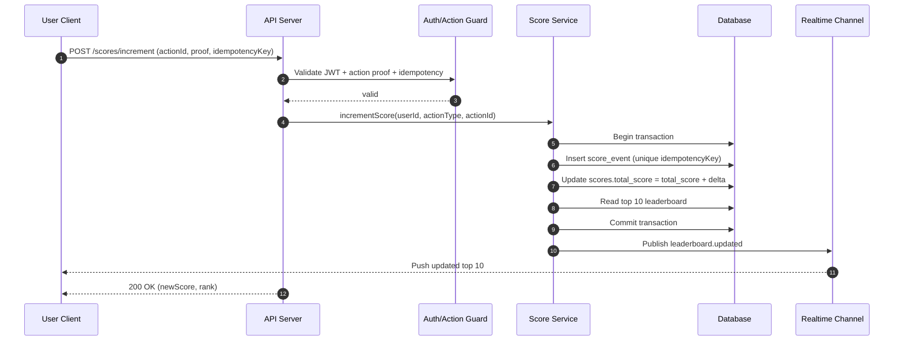

# Scoreboard API Module Specification

This document specifies the backend API module for a live scoreboard feature.
The target audience is a backend engineering team that will implement and operate this module.

## Objective

Build a secure backend module that:
- stores and updates user scores based on valid user actions,
- exposes a top-10 leaderboard,
- pushes live leaderboard updates to connected clients,
- prevents unauthorized or malicious score manipulation.

## Scope

- In scope:
  - score increment endpoint (triggered by action completion),
  - top-10 leaderboard retrieval endpoint,
  - live update channel (WebSocket or Server-Sent Events),
  - action validation and anti-abuse controls,
  - audit logging for score mutations.
- Out of scope:
  - front-end rendering/UX,
  - definition of the business action itself,
  - identity provider implementation (assume auth token already exists).

## Functional Requirements

1. Show top 10 users by score.
2. Users can complete an action that increases their score.
3. Client dispatches API request to update score after action completion.
4. Scoreboard updates should be visible in near real-time.
5. Unauthorized/malicious score increases must be blocked.

## Non-Functional Requirements

- **Security**: all write endpoints require authenticated user context and signed action proof.
- **Consistency**: score increments must be atomic.
- **Latency**: leaderboard reads should be fast (p95 < 150ms target).
- **Scalability**: support high read fanout for live updates.
- **Observability**: logs, metrics, and trace IDs for score update flow.

## Proposed Module Design

- `ScoreController`
  - handles HTTP/WebSocket/SSE interaction,
  - maps DTOs to service calls.
- `ScoreService`
  - validates action claims,
  - applies scoring rules,
  - coordinates repository + pub/sub publish.
- `ScoreRepository`
  - persists scores and action events,
  - returns top-10 leaderboard query.
- `LiveUpdatePublisher`
  - emits scoreboard update events to subscribers.
- `ActionAuthGuard` / middleware
  - verifies JWT/session and action signature/idempotency key.

## Data Model (Conceptual)

### `users`
- `id` (string, PK)
- `display_name` (string)
- `is_banned` (boolean)

### `scores`
- `user_id` (string, PK/FK -> users.id)
- `total_score` (integer, non-negative)
- `updated_at` (timestamp)

### `score_events`
- `id` (string, PK)
- `user_id` (string, FK)
- `action_type` (string)
- `score_delta` (integer > 0)
- `idempotency_key` (string, unique)
- `created_at` (timestamp)
- `metadata` (json)

## API Contract (v1)

### 1) Increment score after action completion

- `POST /api/v1/scores/increment`

Request body:

```json
{
  "actionType": "daily_quiz_completed",
  "actionId": "evt_12345",
  "idempotencyKey": "6f328e53-418f-48f4-9ca1-3258bd5f6540",
  "proof": "signed-proof-or-server-issued-token"
}
```

Response:

```json
{
  "userId": "u_1001",
  "newScore": 1230,
  "delta": 10,
  "leaderboardRank": 7
}
```

Validation and security rules:
- require authenticated user token,
- require valid action proof (signed, unexpired, intended for same user),
- require unique `idempotencyKey` per logical action,
- reject duplicates without double-counting.

### 2) Get top-10 leaderboard

- `GET /api/v1/leaderboard?limit=10`

Response:

```json
{
  "generatedAt": "2026-05-04T15:00:00.000Z",
  "items": [
    { "rank": 1, "userId": "u_1", "displayName": "Alice", "score": 5000 }
  ]
}
```

### 3) Subscribe to live leaderboard updates

- `GET /api/v1/leaderboard/stream` (SSE)  
  or  
- `WS /api/v1/leaderboard/ws` (WebSocket)

Event payload:

```json
{
  "type": "leaderboard.updated",
  "generatedAt": "2026-05-04T15:00:00.000Z",
  "items": []
}
```

## Execution Flow Diagram



## Abuse Prevention Strategy

- JWT/session auth on all write operations.
- Signed action proof generated by trusted backend component.
- Idempotency key + unique DB constraint to stop replay attacks.
- Optional rate limiting per user/IP/device.
- Server-side scoring rules only (never trust client-provided `delta`).
- Audit trail in `score_events` for forensic checks.

## Error Handling (Examples)

- `401 Unauthorized`: missing/invalid auth token.
- `403 Forbidden`: action proof invalid/expired/user mismatch.
- `409 Conflict`: duplicate action or idempotency key replay.
- `422 Unprocessable Entity`: malformed payload.
- `429 Too Many Requests`: throttled due to abuse protection.

## Additional Comments for Improvement

1. **Introduce a read-optimized leaderboard cache (Redis sorted set).**  
   Use Redis as the first read layer for top-10 leaderboard queries to reduce database load and improve latency under high traffic. Keep the relational database as the source of truth and update Redis immediately after successful score transactions. Add fallback logic so if Redis is unavailable, the API can still serve leaderboard reads from the database.

2. **Harden idempotency and replay protection beyond a single request.**  
   Persist `idempotencyKey` with a TTL policy and make uniqueness scoped by user and action type, not only globally. Return a deterministic response for duplicate idempotent requests so retried client calls are safe and predictable. Consider storing a hash of request payload fields to detect suspicious reuse of a key with altered input.

3. **Add asynchronous reconciliation and anomaly detection jobs.**  
   Run scheduled jobs that recompute total scores from `score_events` and compare against `scores.total_score`. Flag and quarantine inconsistencies for review instead of silently correcting them. This protects against bugs, partial failures, and data corruption while producing an auditable trail.

4. **Formalize anti-cheat policy and enforcement tiers.**  
   Define concrete detection rules (for example: max actions per minute, impossible score growth, repeated token signatures, unusual IP/device switching). Separate responses by severity: soft throttle, temporary block, or permanent ban trigger. Emit structured fraud signals to a separate stream/topic for security review tools.

5. **Add robust concurrency and failure-mode testing.**  
   Include integration tests for concurrent score increments on the same user, duplicate `idempotencyKey` races, and real-time stream fanout during heavy write traffic. Add chaos scenarios such as DB timeout during transaction, cache write failure after DB commit, and realtime broker disconnect. Validate invariants such as non-negative score and no double-counting.

6. **Define service-level objectives (SLOs) and operational alerts early.**  
   Track p50/p95/p99 latency for increment and leaderboard endpoints, real-time publish delay, stream disconnect rate, and percentage of failed action validations. Set alert thresholds with clear runbooks (who responds, expected mitigation, escalation path). This makes the module production-ready instead of only feature-complete.

7. **Plan versioning and compatibility strategy for clients.**  
   Keep `/v1` in paths and define deprecation policy (minimum support window, sunset headers, migration notes). For live update payloads, include schema version fields so clients can safely evolve. Publish contract changes with examples before deployment to prevent breaking app releases.

8. **Strengthen observability with traceable score mutation history.**  
   Require a correlation ID on every write request and propagate it through logs, DB event records, and publish events. This enables end-to-end tracing from user action to leaderboard update and simplifies incident debugging. Add dashboards for mutation volume, rejected actions, fraud flags, and top affected users.
